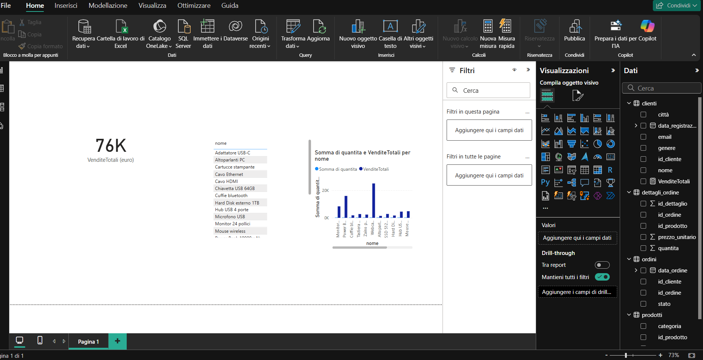

# Mini E-Commerce SQL Project – Analisi delle vendite per ottimizzare il business

## Descrizione

Questo progetto simula un mini e-commerce fittizio per esercitarsi con la creazione di database relazionali e l'analisi dati usando SQL.  
Comprende quattro tabelle principali: `prodotti`, `clienti`, `ordini` e `dettagli_ordine`.  

L'obiettivo è imparare a modellare un database, inserire dati e scrivere query per analizzare il business, come identificare i prodotti più venduti, i clienti più attivi e il fatturato per categoria.

## Struttura del progetto

/sql/
- creazione_tabelle.sql : script per la creazione delle quattro tabelle principali.
- inserimento_dati.sql : script per l'inserimento dei dati in prodotti, clienti, ordini, ecc.
- query_analisi.sql : script contenente query per l'analisi dei dati (in continuo aggiornamento).

/powerbi/
 - mini_ecommerce_report.pbix   # File Power BI completo con grafici e KPI
 - report1.png           # Screenshot del report per il README

/mini_ecommerce.db       --> Database SQLite

/README.md               --> Descrizione del progetto

## Come usare

1. Aprire il file `mini_ecommerce.db` con **DB Browser for SQLite** o un altro client SQLite.  
2. Eseguire gli script SQL nella cartella `/sql/` per creare e popolare le tabelle, se necessario.  
3. Scrivere query SQL nella sezione “Esegui SQL” per analizzare i dati.

## 📊 Dashboard in Power BI

Questo progetto include un report realizzato con Power BI, basato sui dati del mini e-commerce.  
Il report mostra le vendite totali, quantità per prodotto e altri KPI utili per il business.

## Possibili sviluppi futuri

- Aggiungere query SQL di analisi avanzata  
- Collegare il database a strumenti di visualizzazione come Power BI o Tableau  
- Integrare funzionalità di reporting e dashboard interattive  

## Licenza

Questo progetto è distribuito con licenza MIT.  
Autrice: Margareta Mihaela Pesterau

